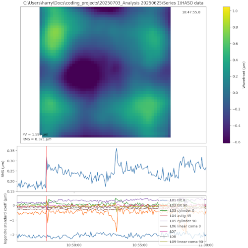

# Installation
1. Install python: https://www.python.org/
2. Install VSCode: https://code.visualstudio.com/
3. Download code ZIP from GitHub repository
4. Open **folder** containing "plot_int_series.py" in VSCode. Download recommended extensions
5. Run the following in the terminal (powershell) in VSCode:

```
& "$env:LOCALAPPDATA\Programs\Python\Python313\Scripts\pip.exe" install -r requirements.txt
```